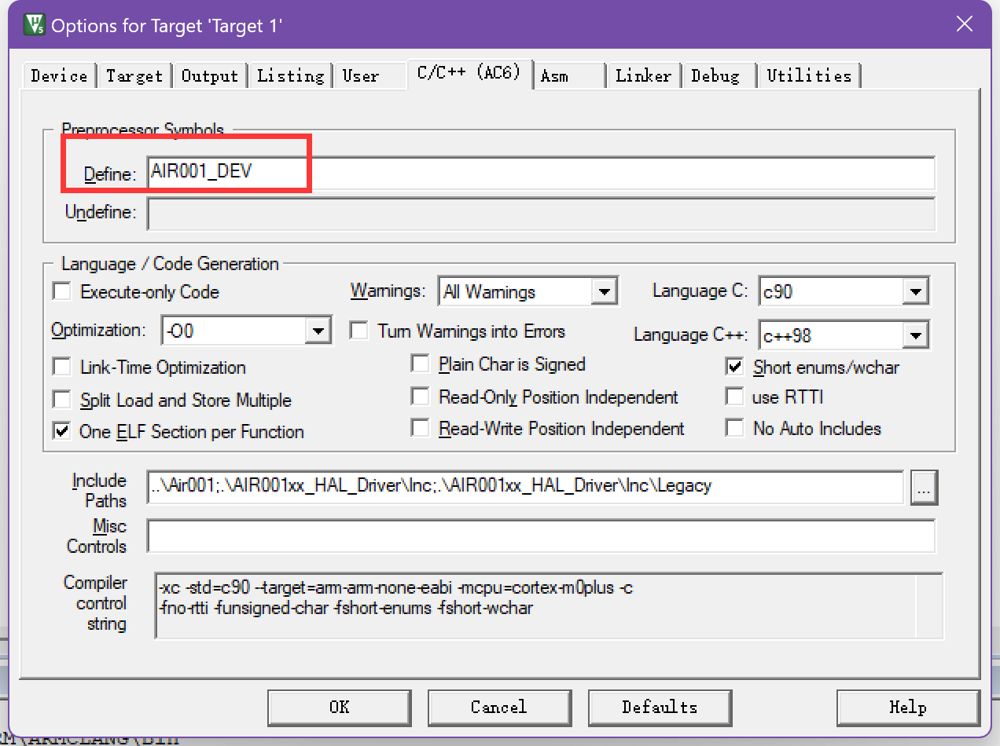
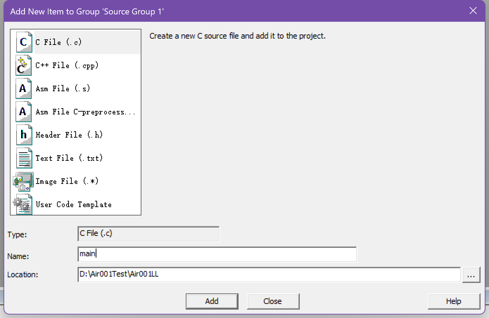
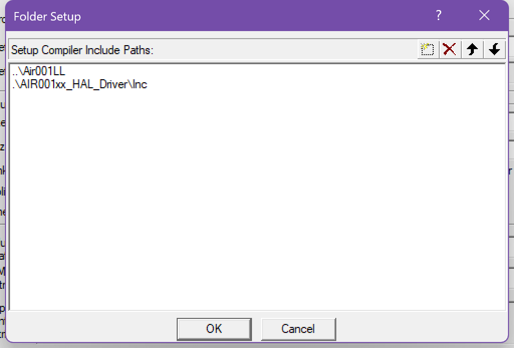
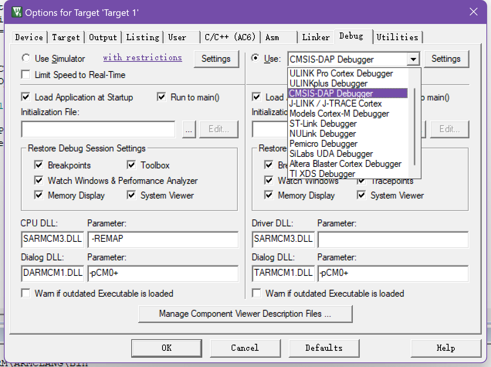
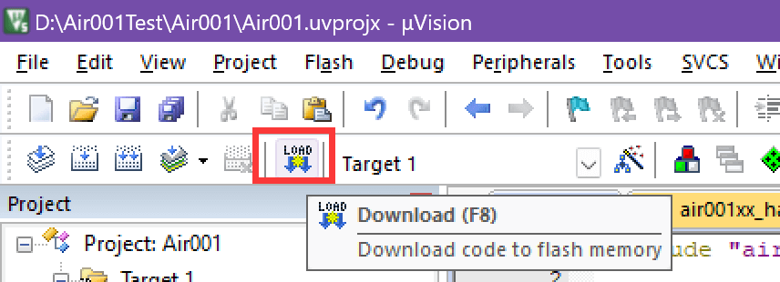

# Air001基于Keil MDK的用户手册

```{note}
可以[在此处获取《HAL_LL函数库说明手册》](https://cdn.openluat-luatcommunity.openluat.com/attachment/20230721175456214_HAL_LL函数库说明手册%20v1.0.0.pdf)

SWD烧录时的Max Clock需要手动到100KHz或更低。
```

## 一、背景

- 背景：本文档主要解决Air001芯片的Keil MDK集成开发环境搭建相关问题，通过新建一个点亮LED的工程来演示。

- 技术定位：初级/中级/高级

- 目标群体：使用Keil MDK进行开发的用户

## 二、HAL库环境搭建（和后面的LL库环境搭建任选一个即可）

### 准备工作

1. 安装MDK5，具体方法请百度，安装后需要激活才能编译大文件
2. 下载安装Air001芯片的SDK：<https://gitee.com/openLuat/luatos-soc-air001>

### 安装支持包

找到PACK文件夹中最新版本的pack文件，双击安装即可，安装后可在keil设备列表的Generic下看到Air001设备。


### 新建工程

#### 0x00 新建工程
点击菜单栏的Project->New μVision Project


创建文件夹和工程名，路径根据自己实际选


#### 0x01 选择设备
选择设备列表中的AirM2M下的AIR001 Series中的AIR001中的AIR001Dev


#### 0x02 添加CMSIS CORE和启动文件
勾选CMSIS下的CORE和Device下的Startup，即可自动配置启动文件


#### 0x03 添加HAL库
在这里我们使用HAL库来作为例子，需要将SDK文件夹中的Libraries目录下的AIR001xx_HAL_Driver文件夹复制在工程目录下，添加完成后的工程目录大概是这样的


#### 0x04 添加HAL库外设源文件
在Keil中添加用到的外设的源文件，一个最小的基于HAL库的工程至少需要添加`air001xx_hal_rcc.c`、`air001xx_hal_rcc_ex.c`、`air001xx_hal_pwr.c`、`air001xx_hal_pwr_ex.c`、`air001xx_hal_cortex.c`、`air001xx_hal_flash.c`、`air001xx_hal.c`

添加`main.c`文件


完全添加后如图所示


#### 0x05 添加hal conf头文件
使用HAL库需要自己定义一个`air001xx_hal_conf.h`文件进行配置，这里我们创建一个


一个典型的例子是

```c
#ifndef __AIR001xx_HAL_CONF_DEFAULT_H
#define __AIR001xx_HAL_CONF_DEFAULT_H

#ifdef __cplusplus
extern "C" {
#endif

#define HAL_MODULE_ENABLED
#define HAL_GPIO_MODULE_ENABLED
#define HAL_RCC_MODULE_ENABLED
#define HAL_FLASH_MODULE_ENABLED
#define HAL_PWR_MODULE_ENABLED
#define HAL_CORTEX_MODULE_ENABLED

#define HSE_VALUE            8000000U  
#define HSE_STARTUP_TIMEOUT  100U      
#define HSI_VALUE            24000000U 
#define HSI_STARTUP_TIMEOUT  5000U     
#define LSI_VALUE            32000U
#define LSE_VALUE            32768U    /*!< Value of the External Low Speed oscillator in Hz */
#define LSE_STARTUP_TIMEOUT  5000U     /*!< Time out for LSE start up, in ms */
#define  TICK_INT_PRIORITY            0x00U /*!< tick interrupt priority */


#include "air001xx_hal_rcc.h"
#include "air001xx_hal_gpio.h"
#include "air001xx_hal_flash.h"
#include "air001xx_hal_pwr.h"
#include "air001xx_hal_cortex.h"

#define assert_param(expr) ((void)0U)

#ifdef __cplusplus
}
#endif

#endif
```

#### 0x06 添加必要中断文件
一个最小工程至少需要一些中断函数，我们需要手动添加
1. 新建`air001xx_it.h`头文件，一个典型的例子如下

```c
#ifndef __AIR001XX_IT_H
#define __AIR001XX_IT_H

#ifdef __cplusplus
 extern "C" {
#endif 
void NMI_Handler(void);
void HardFault_Handler(void);
void SVC_Handler(void);
void PendSV_Handler(void);
void SysTick_Handler(void);

#ifdef __cplusplus
}
#endif
#endif
```
2. 新建`air001xx_it.c`源文件，一个典型的例子如下：

```c
#include "air001xx_it.h"
void NMI_Handler(void)
{
}

void HardFault_Handler(void)
{
  while (1)
  {
  }
}

void SVC_Handler(void)
{
}

void PendSV_Handler(void)
{
}

void SysTick_Handler(void)
{
  HAL_IncTick();
}

```

#### 0x07 添加头文件引用
1. 点击工具栏的魔术棒按钮打开 Options for Target窗口


2. 进入C/C++页面，点击`Include path`后面的三个点


3. 这里我们添加两个目录，一个是`air001xx_hal_conf.h`文件目录，另一个是HAL库所需的头文件目录，如下图


#### 0x08 添加宏定义
1. 点击工具栏的魔术棒按钮打开 Options for Target窗口


2. 进入C/C++页面， 添加`AIR001_DEV`宏 ,如下图所示




#### 0x09 修改`main.c`文件
一个典型的例子如下

```c
#include "air001xx_hal.h"

int main(void)
{
	HAL_Init();
	GPIO_InitTypeDef GPIO_LED = {
		.Pin = GPIO_PIN_0,
		.Mode = GPIO_MODE_OUTPUT_PP,
	};
	__HAL_RCC_GPIOB_CLK_ENABLE();
	HAL_GPIO_Init(GPIOB, &GPIO_LED);

	while (1)
	{
		HAL_GPIO_TogglePin(GPIOB, GPIO_PIN_0);
		HAL_Delay(500);
	}
}

```
点击编译按钮测试是否能编译成功。


本示例工程的开源链接为<https://gitee.com/openLuat/luatos-soc-air001/tree/master/ModuleDemo/Templates/Example_HAL>

### 常见问题
#### 编译出现形如`Error: L6985E: Unable to automatically place AT section system_air001xx.o(.ARM.__at_0x20000000) with required base address 0x20000000. Please manually place in the scatter file using the --no_autoat option. `的错误

这种情况一般来说都是没有添加相应的中断函数/没有添加HAL所需的宏，可以手动检查一下是否有哪些地方出现了错误。

## 二、LL库环境搭建（和前面的HAL库环境搭建任选一个即可）
### 准备工作

1. 安装MDK5，具体方法请百度，安装后需要激活才能编译大文件
2. 下载安装Air001芯片的SDK：<https://gitee.com/openLuat/luatos-soc-air001>

### 安装支持包

找到PACK文件夹中最新版本的pack文件，双击安装即可，安装后可在keil设备列表的Generic下看到Air001设备。


### 新建工程

#### 0x00 新建工程


创建文件夹和工程名，路径根据自己实际选


#### 0x01 选择设备
选择设备列表中的AirM2M下的AIR001 Series中的AIR001中的AIR001Dev


#### 0x02 添加CMSIS CORE和启动文件
勾选CMSIS下的CORE和Device下的Startup，即可自动配置启动文件


#### 0x03 添加LL库
在这里我们使用LL库来作为例子，需要将SDK文件夹中的Libraries目录下的AIR001xx_HAL_Driver文件夹复制在工程目录下，添加完成后的工程目录大概是这样的


#### 0x04 添加LL库外设源文件
在Keil中添加用到的外设的源文件，一个最小的基于LL库的工程至少需要添加`air001xx_ll_utils.c`


添加`main.c`文件



全部添加完成后类似这样

#### 0x05 添加中断函数相关文件
LL库依赖一些中断函数，我们需要重写。
1. 添加`air001_assert.h`和`air001xx_it.h`以及`main.h`文件，每个文件的内容大概如下

`air001_assert.h`
```c
#ifndef __AIR001_ASSERT_H
#define __AIR001_ASSERT_H

#ifdef __cplusplus
extern "C"
{
#endif

#ifdef USE_FULL_ASSERT
#include "stdint.h"
#define assert_param(expr) ((expr) ? (void)0U : assert_failed((uint8_t *)__FILE__, __LINE__))
  void assert_failed(uint8_t *file, uint32_t line);
#else
#define assert_param(expr) ((void)0U)
#endif

#ifdef __cplusplus
}
#endif

#endif

```

`air001xx_it.h`
```c
#ifndef __AIR001F0XX_IT_H
#define __AIR001F0XX_IT_H

#ifdef __cplusplus
extern "C" {
#endif

void NMI_Handler(void);
void HardFault_Handler(void);
void SVC_Handler(void);
void PendSV_Handler(void);
void SysTick_Handler(void);

#ifdef __cplusplus
}
#endif

#endif
```

`main.h`
```c
#ifndef __MAIN_H
#define __MAIN_H

#ifdef __cplusplus
extern "C" {
#endif

#include "air001xx_ll_rcc.h"
#include "air001xx_ll_bus.h"
#include "air001xx_ll_system.h"
#include "air001xx_ll_cortex.h"
#include "air001xx_ll_utils.h"
#include "air001xx_ll_pwr.h"
#include "air001xx_ll_dma.h"
#include "air001xx_ll_gpio.h"

#if defined(USE_FULL_ASSERT)
#include "air001_assert.h"
#endif
void Error_Handler(void);

#ifdef __cplusplus
}
#endif

#endif
```

2. 添加`air001xx_it.c`文件

```c
#include "main.h"
#include "air001xx_it.h"

void NMI_Handler(void)
{
}


void HardFault_Handler(void)
{
  while (1)
  {
  }
}

void SVC_Handler(void)
{
}

void PendSV_Handler(void)
{
}

void SysTick_Handler(void)
{
}
```

#### 0x06 添加对头文件的引用
1. 点击工具栏的魔术棒按钮打开 Options for Target窗口


2. 进入C/C++页面，点击`Include path`后面的三个点


3. 这里我们添加两个目录，一个是`main.c`下的目录，另一个是LL库所需的头文件目录，如下图



#### 0x07 添加芯片宏定义
1. 点击工具栏的魔术棒按钮打开 Options for Target窗口


2. 进入C/C++页面， 添加`AIR001_DEV`宏 ,如下图所示


#### 0x08 修改`mian.c`文件
一个典型的例子如下
```c
#include "main.h"

static void SystemClock_Config(void);

int main(void)
{
  /* 开SYSCFG和PWR时钟 */
  LL_APB1_GRP2_EnableClock(LL_APB1_GRP2_PERIPH_SYSCFG);
  LL_APB1_GRP1_EnableClock(LL_APB1_GRP1_PERIPH_PWR);

  // 配置时钟
  SystemClock_Config();

  LL_IOP_GRP1_EnableClock(LL_IOP_GRP1_PERIPH_GPIOB); // 使能GPIOB时钟
  // 将PB0引脚配置为输出
  LL_GPIO_SetPinMode(GPIOB, LL_GPIO_PIN_0, LL_GPIO_MODE_OUTPUT);

  while (1)
  {
    LL_GPIO_TogglePin(GPIOB, LL_GPIO_PIN_0);
    LL_mDelay(1000);
  }
}

static void SystemClock_Config(void)
{
  // 使能HSI
  LL_RCC_HSI_Enable();
  while (LL_RCC_HSI_IsReady() != 1)
  {
  }

  // 打开AHB时钟
  LL_RCC_SetAHBPrescaler(LL_RCC_SYSCLK_DIV_1);

  // 使用HSI作为系统时钟
  LL_RCC_SetSysClkSource(LL_RCC_SYS_CLKSOURCE_HSISYS);
  while (LL_RCC_GetSysClkSource() != LL_RCC_SYS_CLKSOURCE_STATUS_HSISYS)
  {
  }

  // 设置APB1时钟
  LL_RCC_SetAPB1Prescaler(LL_RCC_APB1_DIV_1);
  LL_Init1msTick(8000000);

  // 设置系统时钟
  LL_SetSystemCoreClock(8000000);
}

void Error_Handler(void)
{
  while (1)
  {
  }
}

#ifdef USE_FULL_ASSERT

void assert_failed(uint8_t *file, uint32_t line)
{

  while (1)
  {
  }
}
#endif

```

点击编译按钮测试是否能编译成功。


本示例工程的开源链接为<https://gitee.com/openLuat/luatos-soc-air001/tree/master/ModuleDemo/Templates/Example_LL>

```{note}
需要注意的是，LL库是`Header-Only`的，这也就意味着如果我们需要引入一个新的外设，只需要在`main.h`中添加相应的头文件，而不需要像是HAL库一样手动添加外设源文件
```

## 三、下载烧录
1. 使用支持SWD的调试器分别连接Air001芯片的SWCLK(PA14)和SWDIO(PA13)，建议使用合宙的DAP-Link调试器连接。

```{note}
如果是购买的小白板和合宙的DAPLink调试器，可以直接通过排针排母相连，方向如图所示

```

2. 点击工具栏的魔术棒按钮打开 Options for Target窗口

3. 进入 Debug页面，仿真器选择CMSIS-DAP Debugger



4. 进入设置界面，Port设置为SW，Max Clock默认10MHz大概率用不了，需要手动适当降低速率到100KHz或者更低


5. 进入`Flash Download`页面，根据目标芯片的型号选择对应的算法，并勾上`Reset and Run`的勾


6. 点击`Download`按钮，即可看见自动下载编译好的代码并运行


