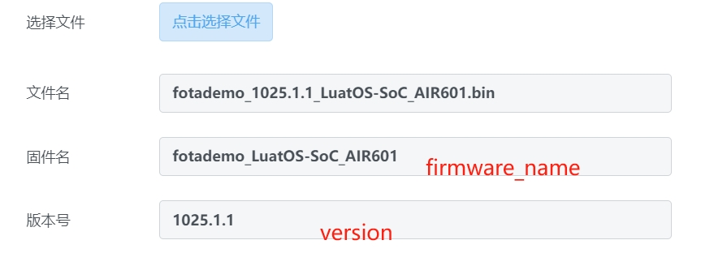

# 使用合宙IOT平台进行升级

虽然这个文章在Air601目录下, 实际对其他任意模块都适用.

这个文章可能比较长, 细节非常多, 请耐心看完

## 使用合宙IOT平台的原因及一些问题

1. 首先, 它当前免费, 稳定性也不错
2. 规则有点复杂, 有点诡异, 之前的文档都没有很好的描述清楚.

## 升级流程是怎样的

一个典型的升级流程是这样的:

1. 用户在合宙IOT平台注册一个账号, 并创建一个项目
2. 获取项目的key, lua代码里叫 `PRODUCT_KEY` , URL参数是 `project_key`
3. libfota/libfota2库, 合成升级的URL
4. http库访问该URL, 下载升级文件, 自动写入到特定的ota/fota区域
5. 重启, 模块进入升级模式
6. 自动完成升级, 流程结束

下面一步一步讲

### IOT平台注册一个账号并创建一个项目

1. 访问网址 [合宙IOT平台](https://iot.openluat.com/)
2. 点大大的 "IoT" 按钮, 进入登录界面
3. 然后就普通注册/登录流程, 没账户就注册一个账户, 忘记密码就找回密码, 这属于基操, 不展开了.
4. 登录后, 点击 "新建项目", 选一个名字, 填入"项目名称"的输入框, 点击"提交", 如无意外就会新增了一个项目

### 获取项目的key

1. 在前面的登陆操作完成后, 在项目列表里, 找到你需要的项目名称的一行
2. 在列表的"项目key"一列, 点击"查看/复制key", 就能得到了, 后续都得用到它

### 合成升级的URL

这一点有点偏技术描述, 如果只是使用libfota/libfota2库, 找到demo, 修改代码里的 `PRODUCT_KEY` 值,然后刷机就行.

合宙IOT平台, 一条典型的升级URL是这样的
```
http://iot.openluat.com/api/site/firmware_upgrade?imei=C81234567830&project_key=b0wlT3yrmIpTSPLi3e7Fob5nvBJxO6pM&firmware_name=fotademo_LuatOS-SoC_AIR601&version=1025.1.0
```

这个URL分几个部分:

1. URL的主体 `http://iot.openluat.com/api/site/firmware_upgrade` , 可见是http协议, 域名是 `iot.openluat.com`, 路径是 `/api/site/firmware_upgrade`
2. 参数`imei`, 虽然名字叫imei, 实际可以是IMEI/MAC地址等等, 只要能唯一标识一个设备就行
3. 参数`project_key`, 上一步获取的, 用于识别是哪一个"合宙iot平台"的项目
4. 参数`firmware_name`, "合宙iot平台"上叫"固件名", 在lua中会用一个比较诡异的方式合成
5. 参数`version`, 版本号, 三段式, 每段最大999

### 访问该URL, 下载升级文件, 写入到特定的ota/fota区域

这个也是libfota/libfota2完成的事情, 技术细节是这样的:

1. 访问前面合成好的URL, 判断服务器的响应码
2. 如果>299, 代表无需升级, 直接退出
3. 开始下载数据到本地, 写入到指定的ota/fota区域
4. 边写入边校验, 校验出错的话直接退出
5. 写入完成,校验完成, 执行回调,通知用户代码
6. 用户代码自行决定重启时机, 当然也可以立即重启

### 重启, 进入升级模式

这个是底层代码完成的事情了, 不展开了, 有兴趣的话查阅各模块的源码吧, luat_fota开头的函数

## 那么, 坑在哪里? 坑是哪些?

### 设备所有权问题

合宙IOT平台, 一个IMEI(实际按URL里的imei参数算), 只能属于一个账户的一个项目

以IMEI为`861234`的设备 为例, 用户`AAA`注册账号并创建`项目PPP`, 然后使用该项目的`项目key`进行升级请求, 那么:

1. 该IMEI不存在于`任何客户`的`任何项目`下, 该设备第一次发起升级请求, 就会`自动`成为`AAA`客户`PPP`项目下的设备
2. 该IMEI在用户`BBB`的账户的任何项目下, 服务器返回 "25 无权限" -- 账户不符
3. 该IMEI在用户`AAA`的账户的`ZZZZ`项目下, 服务器返回 "26 无效的项目" -- 项目不符

### 升级包文件名与URL固件名参数的问题

上报的`firmware_name`参数, 必须与升级包上传界面的"固件名"一致, 否则就会报 `27 无效的固件`

而升级包的文件名, 唯一的作用就是在 "我的固件" 界面中"创建固件"对话框的 自动识别出2个参数

看图 

提醒:

1. 图中的 固件名 对应的参数是 `firmware_name`, 可以修改的
2. 图中的 版本号 对应的参数是 `version`, 也是可以修改的
3. 默认情况下, 这两个参数是根据文件名自动生成的, 然而由于各种历史问题, LuaTools合成的文件名未必能符合要求
4. 如果升级失败提示`27 无效的固件`, 首先检查的就是 `firmware_name` 参数, 然后是 `version` 参数

按最灵活的说法是这样:

1. 升级文件的文件名可以随便起, 例如 123.bin, 只要是bin后缀的就行, 然后它必须是个真正的升级文件
2. 上传界面里选择该文件之后, 自然无法识别出 "固件名" 和 "版本号", 只能手动填写
3. 填入需要的 "固件名" 和 "版本号"

### 那模块的参数怎么搞?

升级URL里, 总共4个参数`imei`/`project_key`/`firmware_name`/`version`

1. 使用libfota库, 只有`project_key`可以配置, 其他是自动生成和识别
2. 使用libfota2库, 4个参数都能自定义配置

所以, 要是:

1. 硬是搞不懂libfota库里firmware_name和version参数的生成规律
2. 或者你压根就不喜欢那种规律, 就想自定义

那么, 用libfota2库, 确保 `firmware_name` 和 `version` 参数都是自定义的, 跟界面上的"固件名"和"版本号"一致, 就没问题了

一个libfota2库的典型日志是这样:

```
[2024-04-10 13:44:46.559] I/user.fota.url	GET	http://iot.openluat.com/api/site/firmware_upgrade?imei=C81234567830&project_key=b0wlT3yrmIpTSPLi3e7Fob5nvBJxO6pM&firmware_name=fotademo_LuatOS-SoC_AIR601&version=1.2.99
[2024-04-10 13:44:46.559] I/user.fota.imei	C81234567830
[2024-04-10 13:44:46.559] I/user.fota.project_key	b0wlT3yrmIpTSPLi3e7Fob5nvBJxO6pM
[2024-04-10 13:44:46.559] I/user.fota.firmware_name	fotademo_LuatOS-SoC_AIR601
[2024-04-10 13:44:46.559] I/user.fota.version	1.2.99
```

再温习一遍这4个参数:

1. imei是设备识别号, 可以是4G设备的imei, 也可以是wifi的mac地址, 也可以是其他唯一识别号, 或者你写12345, 唯一就行
2. project_key是合宙IOT平台项目key, 每个"合宙iot项目"都有唯一的值
3. firmware_name是合宙IOT平台固件名, 是 界面上的 "固件名", 跟文件名没有强相关
4. version是合宙IOT平台固件版本号, 是 界面上的 "版本号"

## 对升级文件再说几句

### 8910方案的模块, 例如Air724UG, Air722UG, Air820UG

1. 在LuaTools生成量产文件时, 勾上 "包含core" 和 "包含脚本"
2. 在量产文件目录里, 能找到 `.bin` 后缀的文件, 这个就是要在iot平台上传的升级文件

### EC618/EC718方案的模块,例如Air780E,Air780EP

1. 只升级脚本, 选量产文件夹里的 `.bin`, 但要求底层完全一致
2. 升级脚本和底层, 准备新老两个soc文件, 然后在菜单里选择 "SoC差分升级工具", 生成新的`.bin`文件, 然后上传

### XT804方案, 例如Air601,Air101,Air103

1. 升级脚本, 选量产文件夹里的 `.bin`, 固件启用OTA功能可用, 会使用文件系统存放升级包
2. 如果底层启用了FOTA功能, 选择 `.fota` 文件, 改后缀之后上传, 记得改 "固件名" 和 "版本号", 使用独占的FOTA区域存放升级包
3. 如果只升级底层脚本, 固件启用了FOTA功能, 可以选 `.sota` 文件, 后缀改成.bin后上传到iot平台, 但通常不太需要

注意, 发布的默认固件都是不带FOTA的, 因为很占空间, 能启用的库很少

如果确需fota功能, 请云编译一份

## 好麻烦, 那我自己建OTA服务器

可以, 但需要你懂一些技术, 比如:

1. 晓得什么是http和服务器
2. 了解如何处理http参数
3. 懂点界面编程

对模块来说, OTA/FOTA的流程就是 请求URL, 是200就继续下载数据然后校验, 不是200就退出.

不能看懂? 那还是算了吧
