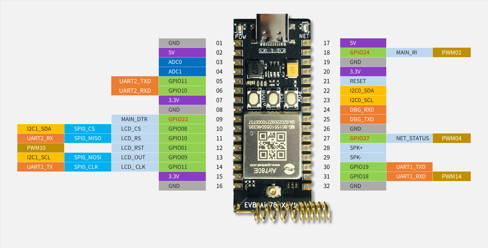

# 开发板

[ Air780E开发板使用说明V1.0.3.pdf](https://cdn.openluat-luatcommunity.openluat.com/attachment/20221214113943532_%E5%BC%80%E5%8F%91%E6%9D%BFCore_Air780E%E4%BD%BF%E7%94%A8%E8%AF%B4%E6%98%8EV1.0.3.pdf)

[Air780E开发板原理图V1.5(pdf版).pdf](https://cdn.openluat-luatcommunity.openluat.com/attachment/20221028114557272_Air780E开发板原理图V1.5(pdf版).pdf)

[Air780E开发板原理图和PCB(立创EDA)](https://oshwhub.com/luat/evb_air780x_v1-6)

[Air780E开发板原理图和PCB(AD格式).zip](https://cdn.openluat-luatcommunity.openluat.com/attachment/20221104135203881_780X开发板原理图和PCB(AD格式).zip)

## 开发板pinout

该图是LuatOS的视角, csdk是支持调整管脚复用关系的

开发板上的按键分别是 BOOT(GPIO0), RESET(复位), PWR(开机键) LED灯(GPIO27)

开发板排针尺寸:
1. 管脚之间的距离, 10mil, 2.54mm
2. 两排管脚之间的距离, 700mil, 17.78mm

提醒:
1. 标红色的是AON_GPIO, 在休眠模式下也可以使用. 非休眠模式下就是普通GPIO
2. UART2与SPI0复用 GPIO11/GPIO10,没有标错
3. DBG即UART0, 是底层日志输出口, 强烈建议不要尝试复用它
4. UART1是主串口, 也支持下载串口, 强烈建议不要复用成GPIO
5. AON_GPIO的驱动能力均很弱!!
6. GPIO均不支持"双向触发",只支持单向触发
7. PWM的最高频率是13M
8. 图中的LCD SPI只是约定排序, 其实就是普通SPI,非"专用"SPI
9. 开发板的IO电平为3.3v, 模块本身可配置1.8v/3.3v
10. SPK是扬声器输出, 需要外接功放, 否则声音很小
11. PWM可用通道共4个, 分别是 0/1/2/4, 但分别由2种映射.后面有小节说明

## 开发板扩展板相关资料

[Air780E开发板喇叭扩展板原理图和PCB(KICAD格式).zip](https://cdn.openluat-luatcommunity.openluat.com/attachment/20221110145812309_Air780E开发板喇叭扩展板V1.0(KICAD格式).zip)

[Air780E开发板喇叭扩展板使用手册.pdf](https://cdn.openluat-luatcommunity.openluat.com/attachment/20221124161022658_Air780E开发板喇叭扩展板使用说明.pdf)

